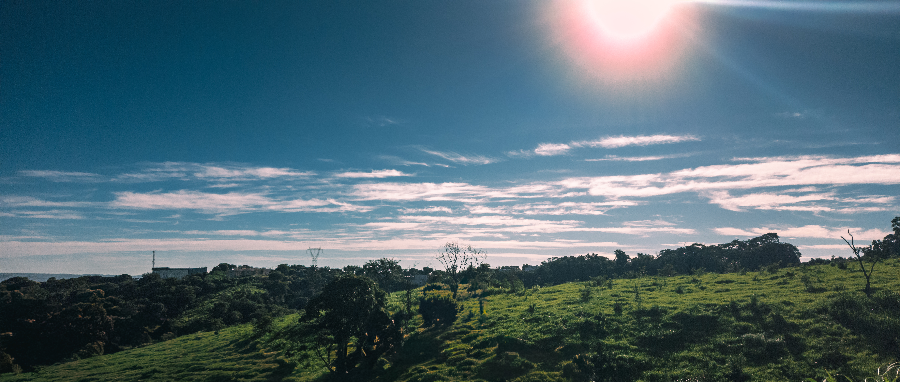

  

   

  <h1 style="border-bottom: none; font-size: 3.5em; margin-bottom: 0; letter-spacing: -1px;">Harlei Melo</h1>
  

    Design Engineer • Flutter Specialist • Creative Developer
  

   

  

    Especialista em unir a <b>estética do design</b> à <b>performance do código</b>. 
    Desenvolvo experiências mobile fluidas com Flutter e interfaces imersivas utilizando shaders GLSL e Three.js. 
    Meu objetivo é transformar protótipos complexos do Figma em produtos digitais de alto desempenho.
  

    

  <table style="border: none; border-collapse: collapse;">
    <tr>
      <td style="border: none; padding: 8px;">
        
      </td>
      <td style="border: none; padding: 8px;">
        
      </td>
      <td style="border: none; padding: 8px;">
        
      </td>
    </tr>
  </table>

    

  

    
  

    

  

    Let's build the <i>unordinary</i>.
  

  
  

    
    
    
  

